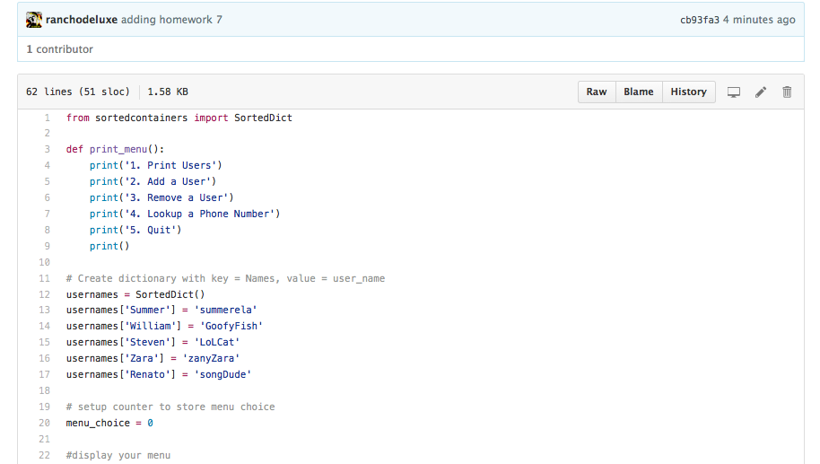
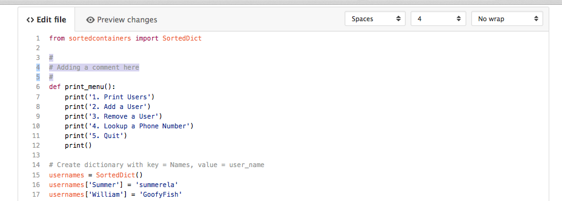
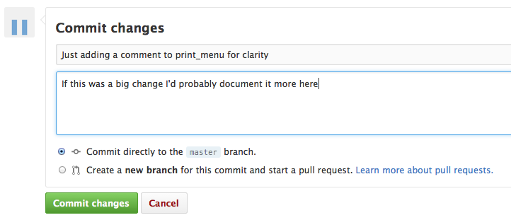

# Module 7 Lab 2

Life is about the `push` and the `pull`

## Instructions:

### The *Push*
  
0. We just created a file called `hw7.py` with Summer. If we list out the contents of our `Module7` directory that contains our git local repository we should see something like this:
  ```
  $ ls -lah
  drwxr-xr-x  14 whizmob  staff   476B Feb 19 18:55 .git/
  -rw-r--r--   1 whizmob  staff    52B Feb 19 18:24 README.md
  -rw-r--r--   1 whizmob  staff     0B Feb 19 19:06 hw7.py
  ```
  
0. Now think about this. What if we wanted to check the "status" of our local repository? Meaning, what if we wanted to list which files have been changed recently or are new? We can use `git` to tell us about this repository by checking the "status" of it. Let's talk about what this means:
  ```
  $ git status
  # On branch master
  # Untracked files:
  #   (use "git add <file>..." to include in what will be committed)
  #
  #	hw7.py
  nothing added to commit but untracked files present (use "git add" to track)
  ```
  
0. Now we're gonna add `hw7.py` to "staging". Say What? Let's talk about what "staging" means in this context:
  ```
  $ git add hw7.py
  ```

0. Let's see what the "status" of our local repository is after "staging" something:
  ```
  $ git status
  # On branch master
  # Changes to be committed:
  #   (use "git reset HEAD <file>..." to unstage)
  #
  #	new file:   hw7.py
  #
  ```
  
0. Let's "commit" our changes in staging so they are ready to "push". What does `-m` option do? What's the point of this statement?:
  ```
   $ git commit -m "adding homework 7"
  [master 098ec88] adding homework 7
   0 files changed
   create mode 100644 homework7.py
  ```
0. Our status has probably changed. Let's talk about it:
  ```
  $ git status
  # On branch master
  # Your branch is ahead of 'origin/master' by 1 commit.
  #
  nothing to commit (working directory clean)
  ```
  
0. Finally, we are ready to push our changes to the remote respository. You will be prompted for your `username` and `password`:
  ```
  $ git push
  Username for 'https://github.com': whizmob
  Password for 'https://whizmob@github.com': 
  Counting objects: 4, done.
  Delta compression using up to 4 threads.
  Compressing objects: 100% (2/2), done.
  Writing objects: 100% (3/3), 286 bytes, done.
  Total 3 (delta 0), reused 0 (delta 0)
  To https://github.com/whizmob/Module7.git
     f95e320..098ec88  master -> master
  ```
  
### The *Pull*

0. Now let's go see this file on Github! Go to you repository dashboard and look for `hw7.py` and click on it. Mine is located here `https://github.com/whizmob/Module7/blob/master/hw7.py`


0. Notice that we can edit this file in the browser. Click the edit pencil


0. Let's make a simple change such as adding a comment above `def print_menu` function


0. Scroll to the bottom. Add a commit message about this file edit and click "Commit changes" button


0. Assuming that went well, then let's go back to our terminal window. It's always a good idea to recheck your
git status to make sure everything is still gravy:
  ```
  $ git status
  # On branch master
  nothing to commit (working directory clean)
  ```

0. Finally, let's "pull" our changes from the remote repo down to our local repo. 
  ```
  $ git pull
  remote: Counting objects: 3, done.
  remote: Compressing objects: 100% (3/3), done.
  remote: Total 3 (delta 1), reused 0 (delta 0), pack-reused 0
  Unpacking objects: 100% (3/3), done.
  From https://github.com/whizmob/Module7
     6d999f1..f84d8d4  master     -> origin/master
  Updating 6d999f1..f84d8d4
  Fast-forward
   hw7.py |    3 +++
   1 file changed, 3 insertions(+)
   ```

  
  
